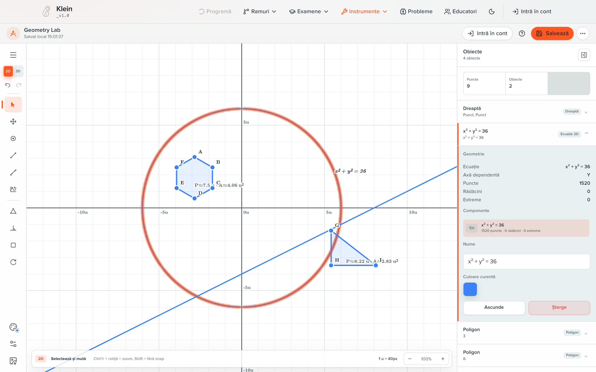
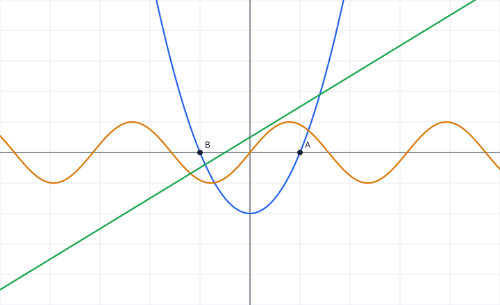
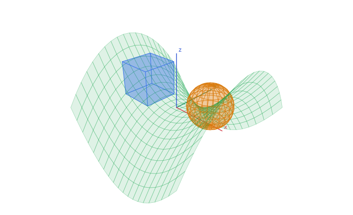
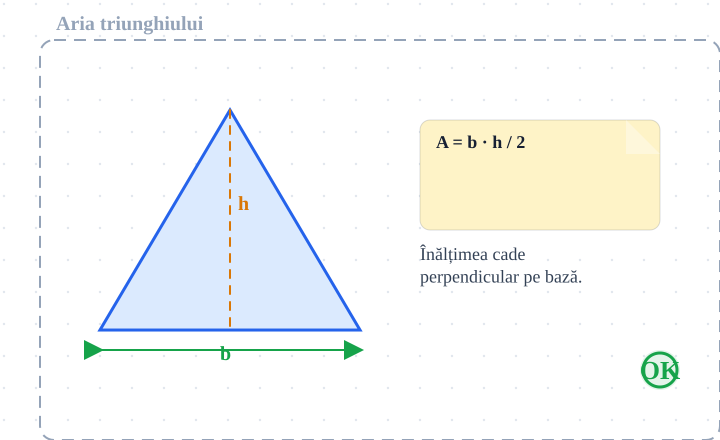

# Klein SDK

The math tools behind [Klein](https://github.com/TheBiggestPotato), as a framework-independent TypeScript library: a graphing calculator, a 2D/3D Geometry Lab, a scientific calculator, a probability explorer and a classroom whiteboard, each with a JSON document model, validation, undo history, SVG rendering and a delta stream that makes real-time collaboration a transport away. Around them sit the contracts a classroom product needs — assignment roles, exam mode, storage, embedding in Teams and Google Classroom, and a learner-safe assessment item format.

<p align="center">
  
  <br>
  <sub>Geometry Lab as the Klein web client hosts it. The runtime, the document, the measurements and the equation curve come from this package; the chrome around them is the client's.</sub>
</p>

No React, no DOM framework, no server: the package is plain ES modules with subpath exports, and it runs in a browser or in Node. The Klein client wraps these runtimes in React; anything else can wrap them in anything else.

## What the SDK renders

Every picture below was produced by the SDK alone — build a document through the API, ask it for SVG. [`examples/render-gallery.mjs`](examples/render-gallery.mjs) is the whole script; `npm run gallery` regenerates them.

| Graphing calculator | Geometry Lab (3D) |
|---|---|
|  |  |
| `addExpression('y = x^2 - 4')`, a slider `a` used by `y = a * x + 1`, two labelled points, `export({ format: 'svg' })`. | `addCube`, `addSphere`, `addSurfaceZ` with the saddle preset, `setCameraPreset('isometric')`, `renderGeometryLabSvg3D`. |

| Whiteboard |
|---|
|  |
| A frame, a filled triangle, dashed and arrowed lines, text, a sticky note and a stamp, each added as a plain JSON element through `applyDelta({ op: 'add', element })`, then `exportWhiteboardSvg`. |

## The tools

| Key | What it is | Also answers to | Collaboration |
|---|---|---|---|
| `graphing` | Expressions typed the way a student types them (`y = x^2 - 4`, `a * x + 1`), sliders, points, sampling, roots and intersections, JSON/SVG/CSV export | `geogebra-graphing`, `calculator-grafic` | yes |
| `geometry-lab` | Points, segments, lines, polygons, circles and conics in 2D; points, segments, cubes, spheres, sampled `z = f(x, y)` and equation surfaces in 3D; measurements; camera presets; strict validation with complexity limits | `graphing-3d`, `geogebra-3d`, `geometrie-3d` | yes |
| `scientific` | Deterministic expression evaluation with angle mode, precision and history | `geogebra-scientific`, `calculator-stiintific`, `calculator` | shared history only, when the host enables it |
| `probability` | Distribution models, descriptive statistics, evaluation helpers, CSV export | `geogebra-probability`, `probabilitati-calc` | yes |
| `whiteboard` | Strokes, shapes, lines, text, sticky notes, images, stamps, frames, templates and embedded calculator cards; presence and comments; frame export | `tabla` | yes |

`klein-sdk/tools` is the registry: `KLEIN_V0_TOOLS` describes each tool, `normalizeKleinToolKey` turns any alias into its key, and `createKleinToolRuntime` builds the right runtime for it.

## Install

The package is not on npm. It ships as a tarball built from this repository, which is also how the Klein client consumes it (`vendor/klein-sdk-0.1.0.tgz`):

```bash
git clone https://github.com/TheBiggestPotato/klein-sdk.git
cd klein-sdk
npm ci
npm run build
npm pack            # → klein-sdk-0.1.0.tgz
```

```bash
# in your project
npm install ../klein-sdk/klein-sdk-0.1.0.tgz
```

CI attaches the same tarball to every run on `main` (the `klein-sdk-tarball` artifact), built from exactly the `dist/` the quality job tested. The package is ESM-only with type declarations; there is no runtime dependency.

## Five minutes with the SDK

### 1. A tool, by key

The runtime is the host-facing object: commands go in, deltas come out, the snapshot is what you save.

```ts
import { createKleinToolRuntime } from 'klein-sdk/tools';

const lab = createKleinToolRuntime({
  toolKey: 'geometrie-3d',                       // any alias; normalizes to 'geometry-lab'
  container: document.getElementById('tool')!,   // optional: mounts the built-in preview
  onDelta: (delta, meta) => console.log(meta.source, delta),
});

lab.execute({ type: 'addCube', payload: { center: { x: 0, y: 0, z: 1 }, size: 2 } });
lab.execute({ type: 'setCameraPreset', payload: 'isometric' });

const document = lab.getSnapshot();             // plain JSON, safe to persist
lab.validateSnapshot(JSON.parse(saved));        // { ok: true, value } | { ok: false, issues }
```

A command the tool cannot apply comes back as `{ ok: false, error }` with a `KleinSdkError` naming the code and the offending path; the runtime never throws for a bad command, and a snapshot that fails validation is rejected before it is loaded.

### 2. The instrument API, when you know the tool

Each tool also exposes an instrument with methods named after what a person does with it. The graphing calculator:

```ts
import { createGraphingCalculator } from 'klein-sdk/graphing';

const graphing = createGraphingCalculator({ samples: 240 });
const parabola = graphing.addExpression('y = x^2 - 4', { label: 'Parabola', color: '#2563eb' });
const a = graphing.addSlider('a', { value: 1, min: -3, max: 3, step: 0.5 });
graphing.addExpression('y = a * x + 1');
graphing.addPoint(2, 0, { label: 'A' });

graphing.findRoots(parabola);                    // [{ x: -2, y: 0 }, { x: 2, y: 0 }]
graphing.setSliderValue(a, 2);
graphing.undo();

graphing.mount(document.getElementById('plot')!);
const svg = await graphing.export({ format: 'svg', width: 720, height: 440, includeGrid: true });
```

`createGeometryLab`, `createScientificCalculator`, `createProbabilityExplorer` and `createWhiteboard` follow the same shape: `mount`, `destroy`, `getSnapshot`, `loadSnapshot`, `applyDelta`, `subscribeDelta`, `undo`, `redo`, `export`.

### 3. Save and restore

Snapshots and deltas are JSON. Every tool has a fail-closed validator for both, and the validators accept plain objects only — crafted prototypes, accessors or symbols are refused.

```ts
import { parseGeometryLabSnapshotJson, validateGeometryLabDelta } from 'klein-sdk/geometry-lab';
import { createLocalStorageSessionAdapter } from 'klein-sdk/persistence';

const storage = createLocalStorageSessionAdapter();          // dev/demo storage
await storage.save({ sessionId: 'lesson-7', snapshot: lab.getSnapshot() });

const restored = parseGeometryLabSnapshotJson(text);          // throws KleinSdkError on bad input
const check = validateGeometryLabDelta(untrustedDelta);       // { ok, issues }
```

A real backend implements `KleinStorageAdapter` (`save`, `load`, `list`); the SDK never talks to a server itself.

### 4. Collaboration

Two-way binding between a runtime and a transport: local deltas go out, remote deltas come in as `source: 'remote'` and are applied without echo. The instrument does not know it is networked.

```ts
import { bindRuntimeCollaboration, createCollaborationWebSocketTransport } from 'klein-sdk/collab';

const transport = createCollaborationWebSocketTransport({
  sessionId: 'room-42',
  toolKey: 'geometry-lab',
  // The host owns tickets and credentials; the SDK only asks for a URL.
  createUrl: async (afterRevision) => `${await fetchRoomUrl('room-42')}&after=${afterRevision ?? 0}`,
  snapshotProvider: () => lab.getSnapshot(),
  checkpointEveryDeltas: 25,
});

const binding = bindRuntimeCollaboration({ runtime: lab, transport });
await binding.ready;
binding.requestSync();     // pull the room's authoritative snapshot; never pushes local state
```

The WebSocket transport serializes mutations by revision, bounds its offline queue (`maxPendingMessages`, `maxPendingBytes`), resumes from the last applied revision and reconnects with exponential backoff. `createInMemoryCollaborationHub()` and `createInMemoryCollaborationTransport()` give you the same protocol in-process for tests. Do not also forward the constructor's `onDelta` to the transport — the binding already does, and each edit would be sent twice.

### 5. Classroom roles and exam mode

```ts
import { createClassroomPolicy } from 'klein-sdk/classroom';
import { createExamController, watchBrowserExamIntegrity } from 'klein-sdk/exam';

const policy = createClassroomPolicy({ role: 'student', mode: 'student-work', freeze: { frozen: false } });
policy.canEditOwnWork;      // true
policy.canEditTemplate;     // false

const exam = createExamController({
  toolKey: 'graphing',
  profile: {
    id: 'bac-2026', allowedTools: ['graphing', 'scientific'], disabledFeatures: [],
    allowCollaboration: false, allowExport: false, allowImport: false,
    allowExternalLinks: false, requireFullscreen: true, requireSnapshotSigning: true,
  },
  onEvent: event => sendToServer(event),
});
await exam.start();
exam.canExecute({ type: 'export', payload: 'svg' });     // { allowed: false, code: 'exam_export_denied', … }
const stop = watchBrowserExamIntegrity(exam);            // fullscreen, visibility, focus, network events
```

Exam mode is a *soft* policy: it gates SDK commands and records integrity events (`command-blocked`, `visibility-hidden`, `window-blurred`, `network-offline`, …) for the host to send on. It does not lock a device down, and it does not pretend to.

### 6. Assessment items that cannot leak an answer

`klein-sdk/assessment` is the versioned interchange contract for exercise and exam content: content blocks (text, LaTeX, first-party assets, PDF page references, media, code, tool starters), interactions (choice, boolean, text, numeric, expression, photo, tool snapshot, composite) and a **learner-safe item** DTO that is rejected if it carries answer keys, solutions, scoring rules, rubrics or feedback.

```ts
import { assertLearnerSafeAssessmentItemV1, validateAssessmentResponseV1 } from 'klein-sdk/assessment';
import item from 'klein-sdk/assessment/fixtures/learner-safe-item.json' with { type: 'json' };

assertLearnerSafeAssessmentItemV1(item);        // throws with the offending path otherwise
validateAssessmentResponseV1(response);         // { ok, issues }
```

The fixtures under `fixtures/assessment/v1/` are the canonical examples; the Klein server's contract tests and the client's renderer tests both consume the same files.

### 7. Theme and embedding

Palettes are host-owned and never saved into a snapshot or sent over collaboration:

```ts
import { applyKleinToolTheme, resolveKleinToolTheme } from 'klein-sdk/theme';

applyKleinToolTheme(container, resolveKleinToolTheme({ name: 'school', primary: '#0057b8' }));
```

Launch contexts for iframes and platform tabs are URL-encoded, parsed and (optionally) signature-checked by the SDK; the host app owns SSO/OAuth and the platform APIs:

```ts
import { createEmbedUrl, parseEmbedSearchParams, verifyEmbeddedLaunchContext } from 'klein-sdk/embed';
import { createTeamsTabUrl } from 'klein-sdk/integrations/teams';
import { createClassroomIframeUrl } from 'klein-sdk/integrations/google-classroom';

const url = createEmbedUrl({
  baseUrl: 'https://tools.example.org',
  context: { platform: 'google-classroom', tool: 'graphing', mode: 'assignment-student', assignmentId: 'cw-123' },
});
const context = parseEmbedSearchParams(location.search);
const verified = await verifyEmbeddedLaunchContext({ context, verifySignature: checkWithMyBackend });

createTeamsTabUrl({ baseUrl: 'https://tools.example.org', tool: 'geometry-lab', roomId: 'room_123' });
createClassroomIframeUrl({ baseUrl: 'https://tools.example.org', iframe: 'student-view', tool: 'graphing', itemId: 'courseWork_123' });
```

[`integrations/teams`](integrations/teams) and [`integrations/google-classroom`](integrations/google-classroom) hold the manifest and route templates; [`apps/web-host`](apps/web-host) lists the routes a hosting app is expected to serve.

## Entry points

Supported surface (v0):

| Subpath | Contents |
|---|---|
| `klein-sdk/tools` | `KLEIN_V0_TOOLS`, `createKleinToolRuntime`, `normalizeKleinToolKey`, `getKleinToolDefinition`, `isKleinToolKey`, `requireKleinToolKey` |
| `klein-sdk/core` | The contracts everything implements: `KleinInstrument`, `KleinToolRuntime`, `DeltaMeta`, `ToolCommand`, `ValidationResult`, `KleinSdkError` |
| `klein-sdk/graphing` | `createGraphingCalculator`, `createGraphingRuntime`, snapshot/delta validators, `parseGraphExpression`, `sampleGraphExpression`, `findGraphRoots`, `findGraphIntersections` |
| `klein-sdk/geometry-lab` | `createGeometryLab`, `createGeometryLabRuntime`, validators, `parseGeometryLabSnapshotJson`, `compileEquationSurface3D`, `renderGeometryLabSvg3D`, complexity limits and preflight checks |
| `klein-sdk/graphing-3d` | Compatibility facade over Geometry Lab for hosts that still launch `graphing-3d` |
| `klein-sdk/scientific`, `klein-sdk/calculator` | `createScientificCalculator`, `createScientificCalculatorRuntime`, validators, `applyCalculatorDelta` |
| `klein-sdk/probability` | `createProbabilityExplorer`, `createProbabilityRuntime`, validators, `evaluateDistributionModel` |
| `klein-sdk/whiteboard` | `createWhiteboard`, `createWhiteboardRuntime`, validators, `exportWhiteboardSvg`, `exportWhiteboardFrameSvg`, delta compaction, presence overlay, comments, embedded cards |
| `klein-sdk/classroom` | `createClassroomPolicy`, `createClassroomRuntime`, `CLASSROOM_API_ROUTES` |
| `klein-sdk/exam` | `createExamController`, `watchBrowserExamIntegrity`, `EXAM_API_ROUTES` |
| `klein-sdk/assessment` | Contract v1 types, validators and `assert…` guards; fixtures at `klein-sdk/assessment/fixtures/*` |
| `klein-sdk/persistence` | `KleinStorageAdapter`, `createKleinStorageAdapter`, `createLocalStorageSessionAdapter` |
| `klein-sdk/collab` | `CollabMessage`, `bindCollaboration`, `bindRuntimeCollaboration`, `createCollaborationWebSocketTransport`, `createCollaborationWebSocketUrl`, `parseCollaborationMessage`, in-memory hub and transport, `sendCollaborativeCursor` |
| `klein-sdk/embed` | `createEmbedUrl`, `parseEmbedSearchParams`, `verifyEmbeddedLaunchContext`, `createEmbedHostBridge` |
| `klein-sdk/integrations/teams`, `klein-sdk/integrations/google-classroom` | `createTeamsTabUrl`, `createTeamsManifest`, `createClassroomIframeUrl`, `parseGoogleClassroomContext` |
| `klein-sdk/math`, `klein-sdk/geometry-core`, `klein-sdk/dom`, `klein-sdk/theme` | The foundations the tools are built on: expression parsing and evaluation, geometry constructions and dependency graphs, custom-element helpers, palettes |

Present for development, not part of the v0 promise: `klein-sdk/algebra`, `klein-sdk/spreadsheet`, `klein-sdk/workspace`, `klein-sdk/geometry` (the classic shell).

## How it is built

A few rules hold across the package; they are what make the tools composable.

- **Documents are JSON, and validated on the way in.** A snapshot or a delta from disk, from the network or from a URL goes through a validator that fails closed. Geometry Lab additionally bounds scene size, sampled meshes, delta nesting and export size (`resolveGeometryLabComplexityLimits`), so a hostile document cannot exhaust a browser.
- **Deltas are the unit of change.** Every mutation — a command, a direct `applyDelta`, an undo — is emitted through `subscribeDelta` with a `DeltaMeta` naming its source (`local`, `remote`, `history`, `import`). Collaboration, autosave and audit all hang off that one stream.
- **Hosts own the outside world.** Authentication, tickets, persistence, networking, theming, device lockdown: the SDK defines the contract and the host implements it. Nothing here stores a credential.
- **Nothing carries an answer.** The assessment contract is designed so that what reaches a learner cannot contain the key, and the validators enforce it structurally rather than by convention.
- **Rendering is a pure function of the snapshot.** SVG export is deterministic, which is why the gallery above can be regenerated and diffed.

## Development

```bash
npm ci
npm run typecheck          # tsc, no emit
npm run build              # → dist/ (ESM + .d.ts)
npm run test:ci            # typecheck, build, node --test suites, smoke scripts
```

Focused suites: `npm run test:geometry-lab`, `test:assessment`, `test:collab`, `test:graphing`, `test:v0`. Tests live in `tests/` and run with Node's built-in runner against `dist/`; the smoke scripts in `scripts/` exercise the public entry points end to end.

CI (`.github/workflows/ci.yml`) runs `test:ci` and a dry `npm pack` on every push, Sonar when the secrets are present, and publishes the tarball artifact from `main` and tags.

Layout:

```
src/           one folder per subpath export; geometry-lab/ is split by concern
tests/         node --test suites (assessment, collab, geometry-lab)
scripts/       smoke scripts run by test:ci
fixtures/      assessment contract examples, shipped in the package
examples/      the gallery renderer and its output
apps/          the hosted-app route contract
integrations/  Teams and Google Classroom templates
```

## Related

- **klein-client** — the Next.js application that hosts these tools for Klein's classrooms and exams.
- **klein-server** — the Spring Boot API behind it: accounts, classrooms, exams, the collaboration relay.
- **klein-tests** — the cross-repository browser suite.

`klein-tools-sdk` is the deprecated predecessor; nothing here depends on it.

## License

MIT
